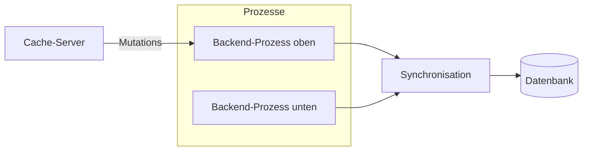

# Systemübersicht (vereinfacht)

```mermaid
flowchart LR
    %% Knoten (Anordnung wie im Bild)
    C[Cache-Server]
    subgraph Prozesse
        direction TB
        B1[Backend-Prozess oben]
        B2[Backend-Prozess unten]
    end
    S[Synchronisation]
    D[(Datenbank)]

    C -->|Mutations| B1
    B1 --> S
    B2 --> S
    S --> D

```